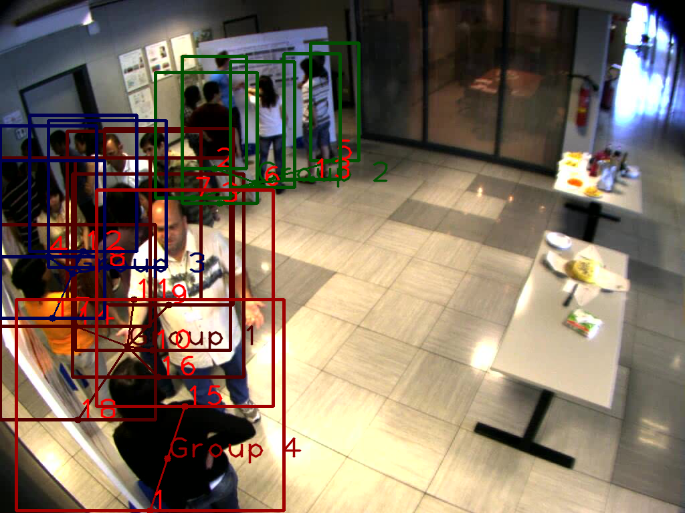
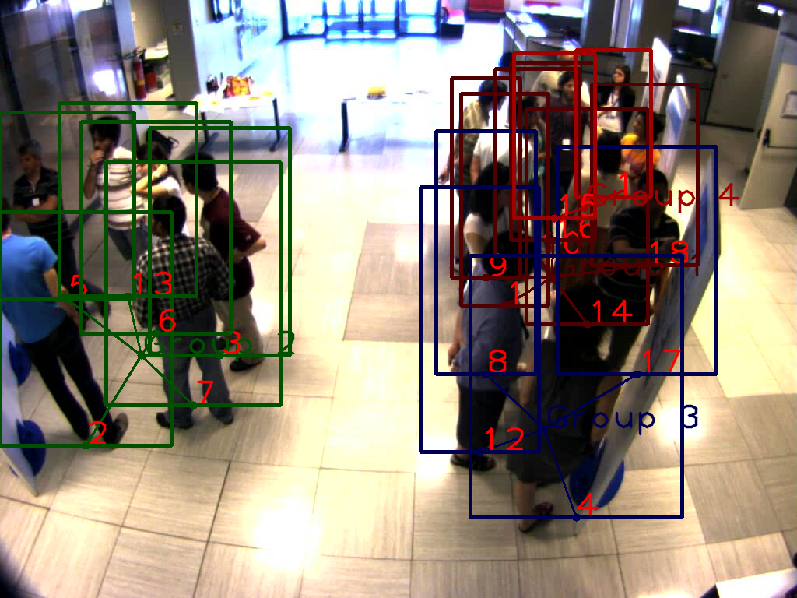
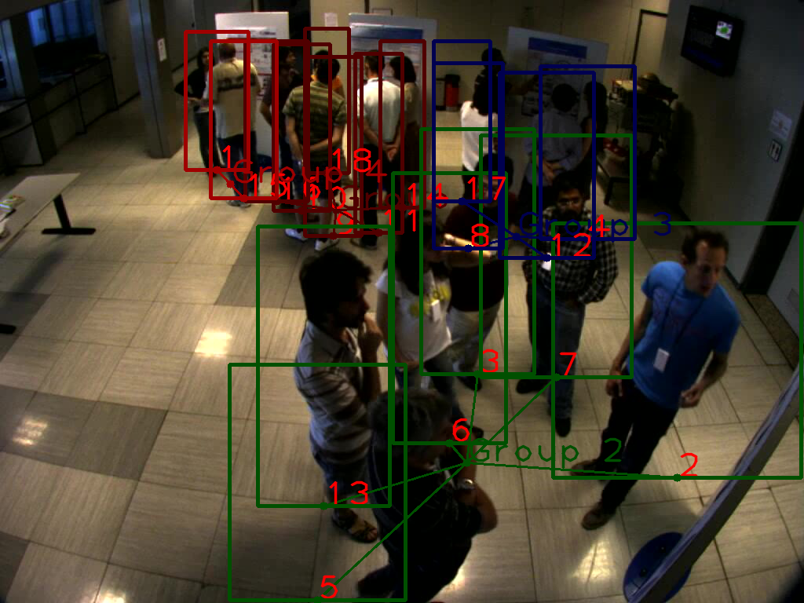
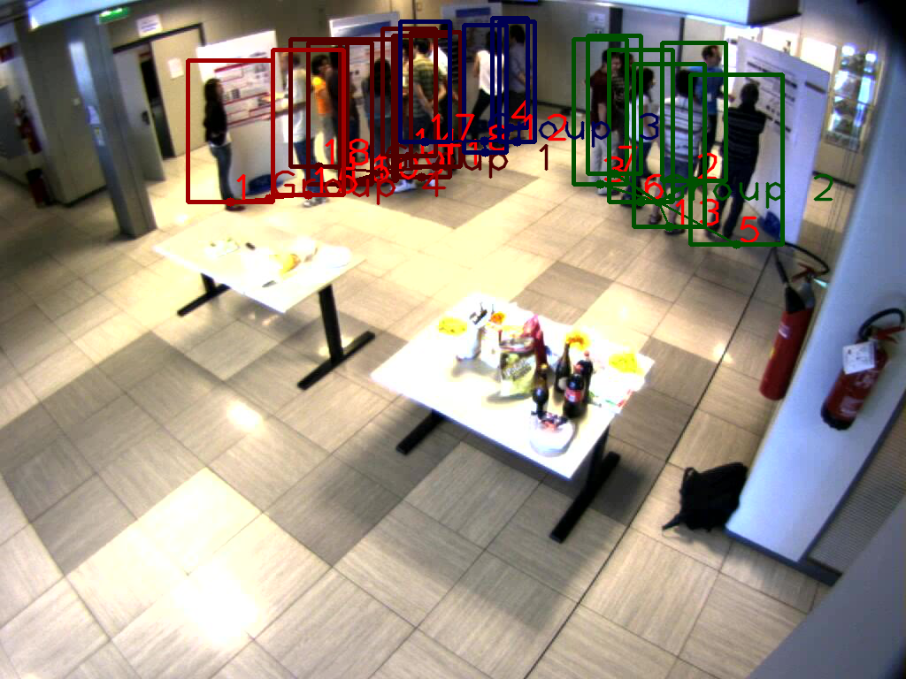

##Studying Social Interactions through Computer Vision

###Introduction
The goal of this project is to find conversational groups among people in the image as well as the group membership.
More specificlly, we want to predict F-formation, which is a spatial arrangement of people's social behavior.

###Pipeline
To predict F-formation with estimated positions and orientations:
1. Multi-camera Multi-target Detection: https://github.com/pierrebaque/DeepOcclusion
2. Tracking (Optional): https://github.com/cvlab-epfl/pyKSP
3. Orientation Estimation and F-formation Prediction: Run GroupVoting_estInputs.ipynb.

To predict F-formation with annotated positions and orientations:
Directly run GroupVoting.ipynb.

###Testing Data
SALSA Dataset: http://tev.fbk.eu/salsa

###Results
View1

View2

View3

View4

